# 🖥️ Dynamic PC Builder Platform

## 📖 About The Project
This project is a smart, non-linear PC component selection platform built for our Database Management System (DBMS) course. Unlike traditional e-commerce sites, this platform acts as a **Constraint Satisfaction Engine**. It allows users to build a custom PC by selecting components in *any order* while automatically filtering out incompatible parts (e.g., mismatched CPU sockets, incompatible RAM types, or insufficient power supplies) using advanced SQL queries and relational database concepts.

## ✨ Key Features
* 🔄 **Omni-directional Compatibility Engine:** Start your build from any component (CPU, Motherboard, Case, etc.). The database dynamically filters subsequent choices based on strict hardware compatibility rules.
* ⚡ **Dynamic Wattage Tracker:** Live calculation of total system power consumption (TDP) to recommend appropriate Power Supply Units (PSUs).
* ⚠️ **Bottleneck Warning System (CEP):** Analyzes selected components and triggers a warning if there is a massive performance mismatch (e.g., pairing a low-end CPU with a high-end GPU).
* 📈 **Automated Price History Logs:** Utilizes Database Triggers to automatically log and track the price history of components whenever an admin updates the pricing.
* 💾 **Save & Share Builds:** Users can save their custom PC builds and generate shareable links.
* 🛡️ **Role-Based Access Control:** Separate interfaces and database access levels for Customers and Admins.

## 🗄️ Database Architecture
To handle the unique attributes of different PC components efficiently, we utilized the **Class-Table Inheritance (Generalization/Specialization)** design pattern. 

Instead of a single table with many `NULL` values, common attributes (Name, Price, Brand) are stored in the core `PRODUCTS` table. Specific attributes (like `socket_type` for CPUs or `wattage` for PSUs) are stored in specialized sub-tables. 

### Entity-Relationship (ER) Diagram

```mermaid
erDiagram
    USERS {
        string user_id PK
        string name
        string email
        string password_hash
        string role
    }

    CATEGORIES {
        string category_id PK
        string category_name
    }

    PRODUCTS {
        string product_id PK
        string name
        string brand
        float price
        int stock_quantity
        string category_id FK
    }

    CPUS {
        string product_id PK "Also FK to PRODUCTS"
        string socket_type
        int core_count
        float tdp_watt
        int passmark_score
    }

    MOTHERBOARDS {
        string product_id PK "Also FK to PRODUCTS"
        string socket_type
        string form_factor
        string supported_ram_type
        int m2_slots
    }

    RAMS {
        string product_id PK "Also FK to PRODUCTS"
        string ram_type
        int capacity_gb
        int speed_mhz
    }

    GPUS {
        string product_id PK "Also FK to PRODUCTS"
        float length_mm
        float tdp_watt
        int passmark_score
    }

    CASINGS {
        string product_id PK "Also FK to PRODUCTS"
        string supported_form_factors
        float max_gpu_length_mm
    }

    PSUS {
        string product_id PK "Also FK to PRODUCTS"
        float wattage
        string form_factor
    }

    BUILDS {
        string build_id PK
        string build_name
        float total_price
        float total_wattage
        date created_at
        string user_id FK
    }

    BUILD_ITEMS {
        string build_item_id PK
        string build_id FK
        string product_id FK
        int quantity
    }

    PRICE_HISTORY_LOG {
        string log_id PK
        float old_price
        float new_price
        date change_date
        string product_id FK
    }

    %% Core Relationships
    USERS ||--o{ BUILDS : "saves"
    CATEGORIES ||--o{ PRODUCTS : "contains"
    
    %% Inheritance Relationships (1 to 0 or 1)
    PRODUCTS ||--o| CPUS : "is_a"
    PRODUCTS ||--o| MOTHERBOARDS : "is_a"
    PRODUCTS ||--o| RAMS : "is_a"
    PRODUCTS ||--o| GPUS : "is_a"
    PRODUCTS ||--o| CASINGS : "is_a"
    PRODUCTS ||--o| PSUS : "is_a"
    
    %% Build Details and Logs
    BUILDS ||--|{ BUILD_ITEMS : "has"
    PRODUCTS ||--o{ BUILD_ITEMS : "included_in"
    PRODUCTS ||--o{ PRICE_HISTORY_LOG : "tracked_in"

    %% Core Relationships
    USERS ||--o{ BUILDS : "saves"
    CATEGORIES ||--o{ PRODUCTS : "contains"
    
    %% Inheritance Relationships (1 to 0 or 1)
    PRODUCTS ||--o| CPUS : "is_a"
    PRODUCTS ||--o| MOTHERBOARDS : "is_a"
    PRODUCTS ||--o| RAMS : "is_a"
    PRODUCTS ||--o| GPUS : "is_a"
    PRODUCTS ||--o| CASINGS : "is_a"
    PRODUCTS ||--o| PSUS : "is_a"
    
    %% Build Details and Logs
    BUILDS ||--|{ BUILD_ITEMS : "has"
    PRODUCTS ||--o{ BUILD_ITEMS : "included_in"
    PRODUCTS ||--o{ PRICE_HISTORY_LOG : "tracked_in"

```

## ⚙️ How to Setup the Database
1. Open your MySQL client (Workbench/CLI).
2. Run the scripts in the `database/` folder in the following order:
   - First, run `01_schema.sql` to create the database and tables.
   - Second, run `02_dummy_data.sql` to populate the tables with initial hardware data.
