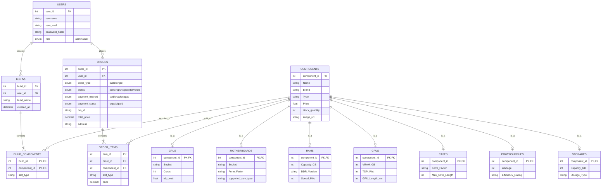

# 🖥️ NextGen PC Builder Platform (Full E-Commerce)

## 📖 About The Project
This project is an advanced, non-linear PC component selection and e-commerce platform built for our Database Management System (DBMS) course. Unlike traditional e-commerce sites, this platform acts as a **Constraint Satisfaction Engine**. It allows users to build a custom PC by selecting components in *any order* while automatically filtering out incompatible parts (e.g., mismatched CPU sockets, incompatible RAM types, or insufficient power supplies) using complex SQL JOINs and Subqueries.

With the latest updates, it has evolved into a full-fledged **E-Commerce System** featuring secure checkouts, payment tracking, and a comprehensive Admin Panel for inventory and order management.

## ✨ Key Features
* 🔄 **Omni-directional Compatibility Engine:** Start your build from any component (CPU, Motherboard, Case, etc.). The database dynamically filters subsequent choices based on strict hardware compatibility rules.
* ⚡ **Dynamic Wattage & Bottleneck Calculator:** Live calculation of total system power consumption (TDP) to recommend appropriate Power Supply Units (PSUs).
* 🛒 **Integrated E-Commerce & Checkout:** Users can purchase their custom builds or individual parts. Supports multiple payment gateways (bKash, Nagad, Card/Bank) with transaction ID tracking.
* 🖨️ **Print & Share Builds:** Automatically generate and print professional PDF summaries of your custom PC builds.
* 🛡️ **Role-Based Admin Panel (CRUD):** - Manage hardware inventory (Add, Update, Delete components).
  - Track order statuses (Pending, Shipped, Delivered, Cancelled) and payment states.
  - User management (Promote users to Admins, delete accounts).

## 🗄️ Database Architecture
To handle the unique attributes of different PC components efficiently without generating massive `NULL` values, we utilized the **Class-Table Inheritance (Generalization/Specialization)** design pattern. 

Core attributes (Name, Price, Brand, Stock) are stored in the parent `COMPONENTS` table, while unique technical specs (like `Socket` or `Wattage`) are stored in specialized child tables.

### 📊 Schema (ER) Diagram

```mermaid
erDiagram
    USERS {
        int user_id PK
        string username
        string user_mail
        string password_hash
        enum role "admin/user"
    }

    COMPONENTS {
        int component_id PK
        string Name
        string Brand
        string Type
        float Price
        int stock_quantity
        string image_url
    }

    CPUS {
        int component_id PK, FK
        string Socket
        int Cores
        float tdp_watt
    }

    MOTHERBOARDS {
        int component_id PK, FK
        string Socket
        string Form_Factor
        string supported_ram_type
    }

    RAMS {
        int component_id PK, FK
        int Capacity_GB
        string DDR_Version
        int Speed_MHz
    }

    GPUS {
        int component_id PK, FK
        int VRAM_GB
        int TDP_Watt
        int GPU_Length_mm
    }

    CASES {
        int component_id PK, FK
        string Form_Factor
        int Max_GPU_Length
    }

    POWERSUPPLIES {
        int component_id PK, FK
        int Wattage
        string Efficiency_Rating
    }

    STORAGES {
        int component_id PK, FK
        int Capacity_GB
        string Storage_Type
    }

    BUILDS {
        int build_id PK
        int user_id FK
        string build_name
        datetime created_at
    }

    BUILD_COMPONENTS {
        int build_id PK, FK
        int component_id PK, FK
        string slot_type
    }

    ORDERS {
        int order_id PK
        int user_id FK
        enum order_type "build/single"
        enum status "pending/shipped/delivered"
        enum payment_method "cod/bkash/nagad"
        enum payment_status "unpaid/paid"
        string txn_id
        decimal total_price
        string address
    }

    ORDER_ITEMS {
        int item_id PK
        int order_id FK
        int component_id FK
        string slot_type
        decimal price
    }

    %% Relationships
    USERS ||--o{ BUILDS : "creates"
    USERS ||--o{ ORDERS : "places"
    
    %% E-commerce Relationships
    ORDERS ||--|{ ORDER_ITEMS : "contains"
    COMPONENTS ||--o{ ORDER_ITEMS : "sold_as"

    %% Build Details
    BUILDS ||--|{ BUILD_COMPONENTS : "contains"
    COMPONENTS ||--o{ BUILD_COMPONENTS : "included_in"

    %% Inheritance Relationships (1 to 0 or 1)
    COMPONENTS ||--o| CPUS : "is_a"
    COMPONENTS ||--o| MOTHERBOARDS : "is_a"
    COMPONENTS ||--o| RAMS : "is_a"
    COMPONENTS ||--o| GPUS : "is_a"
    COMPONENTS ||--o| CASES : "is_a"
    COMPONENTS ||--o| POWERSUPPLIES : "is_a"
    COMPONENTS ||--o| STORAGES : "is_a"

```
