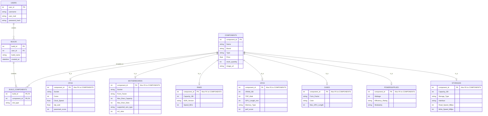

# 🖥️ Dynamic PC Builder Platform

## 📖 About The Project
This project is a smart, non-linear PC component selection platform built for our Database Management System (DBMS) course. Unlike traditional e-commerce sites, this platform acts as a **Constraint Satisfaction Engine**. It allows users to build a custom PC by selecting components in *any order* while automatically filtering out incompatible parts (e.g., mismatched CPU sockets, incompatible RAM types, or insufficient power supplies) using advanced SQL queries and relational database concepts.

## ✨ Key Features
* 🔄 **Omni-directional Compatibility Engine:** Start your build from any component (CPU, Motherboard, Case, etc.). The database dynamically filters subsequent choices based on strict hardware compatibility rules.
* ⚡ **Dynamic Wattage & Price Calculation:** Live calculation of total system power consumption (TDP) and budget tracking through relational JOINs without storing redundant data.
* ⚠️ **Bottleneck Warning System (CEP):** Analyzes selected components and triggers a warning if there is a massive performance mismatch (e.g., pairing a low-end CPU with a high-end GPU).
* 💾 **Save & Manage Builds:** Users can save their custom PC builds, manage their build components securely, and organize them effectively.
* 🖼️ **Visual Component Library:** Each component includes image references and detailed technical specifications for better user experience.

## 🗄️ Database Architecture
To handle the unique attributes of different PC components efficiently, we utilized the **Class-Table Inheritance (Generalization/Specialization)** design pattern. 

Instead of a single table with many `NULL` values, common attributes (Name, Price, Brand, Image, Stock) are stored in the core `COMPONENTS` table. Specific attributes (like `Socket` for CPUs or `Wattage` for Power Supplies) are stored in specialized sub-tables. 

### Schema (ER) Diagram

```mermaid
erDiagram
    USERS {
        int user_id PK
        string username
        string user_mail
        string password_hash
    }

    COMPONENTS {
        int component_id PK
        string Name
        string Brand
        string Type
        float Price
        int stock_quantity
        string image_url
    }

    CPUS {
        int component_id PK "Also FK to COMPONENTS"
        string Socket
        int Cores
        float Clock_Speed
        float tdp_watt
        int passmark_score
    }

    MOTHERBOARDS {
        int component_id PK "Also FK to COMPONENTS"
        string Socket
        string Form_Factor
        int Max_Ram_Capacity
        int Max_Ram_Slots
        string supported_ram_type
        int m2_slots
    }

    RAMS {
        int component_id PK "Also FK to COMPONENTS"
        int Capacity_GB
        string DDR_Version
        int Speed_MHz
    }

    GPUS {
        int component_id PK "Also FK to COMPONENTS"
        int VRAM_GB
        int TDP_Watt
        int GPU_Length_mm
        string Memory_Type
        int perf_score
    }

    CASES {
        int component_id PK "Also FK to COMPONENTS"
        string Form_Factor
        string Color
        int Max_GPU_Length
    }

    POWERSUPPLIES {
        int component_id PK "Also FK to COMPONENTS"
        int Wattage
        string Efficiency_Rating
        string Modularity
    }

    STORAGES {
        int component_id PK "Also FK to COMPONENTS"
        int Capacity_GB
        string Storage_Type
        string Interface
        int Read_Speed_MBps
        int Write_Speed_MBps
    }

    BUILDS {
        int build_id PK
        int user_id FK
        string build_name
        datetime created_at
    }

    BUILD_COMPONENTS {
        int build_id PK, FK
        int component_id PK, FK
        string slot_type
    }

    %% Core Relationships
    USERS ||--o{ BUILDS : "creates"
    
    %% Inheritance Relationships (1 to 0 or 1)
    COMPONENTS ||--o| CPUS : "is_a"
    COMPONENTS ||--o| MOTHERBOARDS : "is_a"
    COMPONENTS ||--o| RAMS : "is_a"
    COMPONENTS ||--o| GPUS : "is_a"
    COMPONENTS ||--o| CASES : "is_a"
    COMPONENTS ||--o| POWERSUPPLIES : "is_a"
    COMPONENTS ||--o| STORAGES : "is_a"
    
    %% Build Details (Many to Many resolved)
    BUILDS ||--|{ BUILD_COMPONENTS : "contains"
    COMPONENTS ||--o{ BUILD_COMPONENTS : "included_in"

```
## ⚙️ How to Setup the Database
1. Open your MySQL client (Workbench/phpMyAdmin/CLI).
2. Create a new database (e.g., pc_builder_db).
3. Import the Backup3.0.sql file to automatically generate the schema, relations, and populate the database with real-world dummy hardware data.
